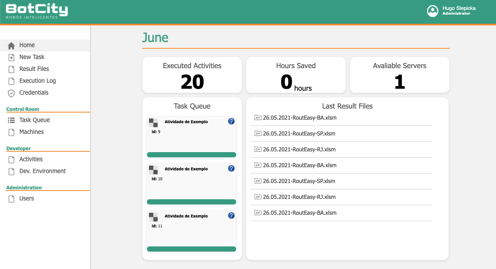

# Orchestration

Development is just a step on th process of deploying an automation in production.

After the development is done it is required to set up the runtime environment and execute
the deployment of the automation in production.

When running an automation process in production it is paramount that one can:

- monitor active automations
- synchronize related activities
- schedule tasks
- analyze logs
- visualize artifacts produced

That is the reason why the orchestrator is the most important tool when running your automations in production.

## BotMaestro

BotMaestro is an automation platform to facilitate the development, deploy and orchestration of automation robots.

The main dashboard displays key metrics, such as number of tasks executed, number of available servers, as well as 
a quick view of the execution queue and latest artifacts produced by the automation pipeline. 
{ align=right }

All functionalities available via the BotMaestro web portal can also be interacted with via:

- HTTPS API
- BotMaestroSDK (Python)
- BotMaestroSDK (Java)
- BotCLI (Command-Line Interface)

## Next Steps

Check out the API documentation.
Let us know where it can be improved.